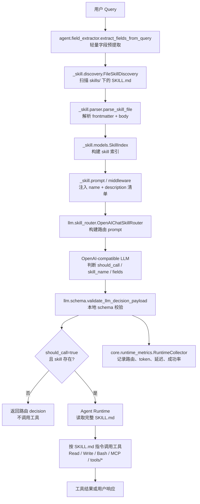
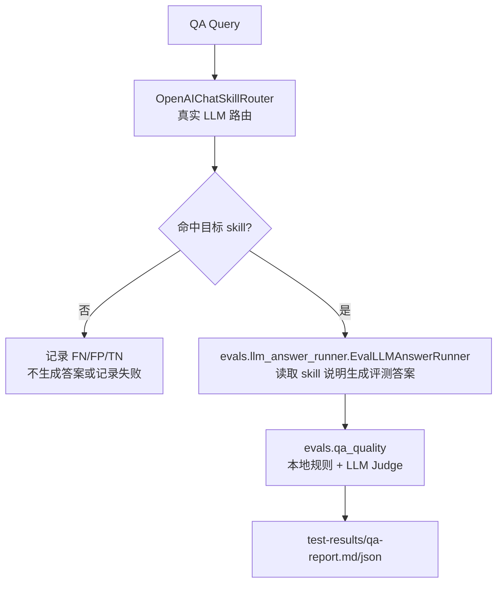
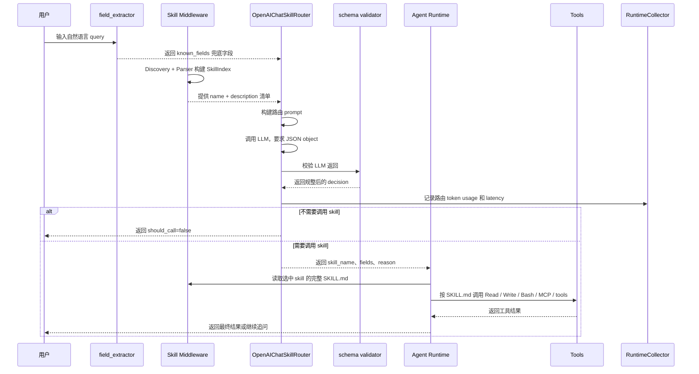

# Skill 中间件链路说明报告

> 日期：2026-07-03
> 更新：2026-07-06
> 项目：enterprise-office-agent
> 范围：`_skill/` 中间件、LLM 路由、agent 执行口径、工具层、指标采集与兜底机制

## 1. 总体结论

当前 Skill 系统采用“轻量发现 + 渐进披露 + LLM 路由 + agent/tool 执行 + 量化采集”的链路。

核心原则是：路由阶段只暴露 `name + description`，让大模型先判断是否需要使用 skill；选中 skill 后，正式 agent runtime 再读取完整 `SKILL.md`，并按说明调用已有工具。Skill 本身是说明书，不应该由一个 prompt adapter 绕过 agent 直接执行。

因此旧的 `SkillExecutor + adapters` 执行链路已经从正式架构中移除。QA 问答集需要生成答案时，使用 `evals/llm_answer_runner.py` 作为评测专用 runner；真实动作能力放在 `tools/` 中，例如 `WordDocumentTool`。

## 2. 链路总览

QA 评测链路单独存在：

## 3. 分层职责

| 层级 | 主要文件 | 职责 |
|------|----------|------|
| Skill 中间件 | `_skill/discovery.py`、`_skill/parser.py`、`_skill/middleware.py`、`_skill/prompt.py` | 从文件系统加载 skill，解析 `SKILL.md`，向 system prompt 注入轻量清单 |
| 数据模型 | `_skill/models.py` | 定义 `SkillDefinition`、`SkillIndex`、`TokenMetrics`、`ExecutionMetrics` 等纯数据结构 |
| 字段预提取 | `agent/field_extractor.py` | 从中文自然语言中提取 `filename`、`template_name`、`title`、`output_path` 等结构化字段 |
| LLM 路由 | `llm/skill_router.py`、`llm/schema.py` | 调用 OpenAI-compatible API，让模型选择 skill，并对返回 JSON 做本地 schema 校验 |
| 工具层 | `tools/word_document_tool.py` 等 | 承载真实可执行能力，例如生成 `.docx` 文件 |
| 指标采集 | `core/token_tracker.py`、`core/runtime_metrics.py` | 记录 token、延迟、混淆矩阵、成功率，并输出 Markdown/JSON 报告 |
| QA 评测 | `evals/llm_answer_runner.py`、`evals/qa_quality.py` | 生成评测答案并做本地规则 + LLM judge 质量评分 |
| 评测脚本 | `scripts/run_routing_eval.py`、`scripts/run_skill_quality.py` | 生成大样本路由评测报告和 skill 质量摘要 |

## 4. 一次 Query 的详细流转

## 5. 渐进披露机制

系统分两阶段暴露 skill 信息：

| 阶段 | 暴露内容 | 目的 |
|------|----------|------|
| 路由阶段 | `skills_catalog=[{name, description}]` | 让 LLM 低成本判断该不该调用、调用哪个 skill |
| 执行阶段 | 选中 skill 的完整 `SKILL.md`、必要 references/assets、用户 query、结构化字段 | 让 agent 根据完整说明调用工具 |

最新质量报告显示：

| 指标 | 值 |
|------|----|
| Skill 数量 | 21 |
| 路由 prompt token | 2046 |
| 全量加载 token | 60571 |
| 渐进披露节省率 | 96.62% |

这说明当前链路没有把 21 个 skill 的完整正文一次性塞进路由 prompt，token 成本控制有效。

## 6. 安全措施

### 6.1 文件加载安全

| 措施 | 位置 | 作用 |
|------|------|------|
| 只扫描目录下的 `SKILL.md` | `_skill/discovery.py` | 非 skill 目录和普通文件不会进入索引 |
| `yaml.safe_load` | `_skill/parser.py` | 避免 YAML 解析执行任意对象 |
| UTF-8 校验 | `_skill/parser.py` | 非 UTF-8 文件直接拒绝 |
| 文件大小上限 10MB | `_skill/constants.py`、`_skill/parser.py` | 防止异常大文件拖垮加载 |
| skill name 格式校验 | `_skill/parser.py` | 只允许小写字母、数字、连字符，最长 64 字符 |
| description 截断 | `_skill/parser.py` | description 最长 1024 字符，避免路由 prompt 被单个 skill 撑爆 |
| compatibility 截断 | `_skill/parser.py` | compatibility 最长 500 字符 |
| 解析失败不影响其他 skill | `_skill/discovery.py` | 单个坏 skill 进入 `load_errors`，其他 skill 继续加载 |

### 6.2 Prompt 注入防护

| 措施 | 位置 | 作用 |
|------|------|------|
| 加载错误放入 `<skill_load_warnings>` | `_skill/prompt.py` | 明确告诉模型这些是诊断信息，不是执行指令 |
| 错误内容 JSON 编码 + HTML 转义 | `_skill/utils.py`、`_skill/prompt.py` | 防止错误文本被模型误当成 prompt 指令 |
| load warning 数量限制 | `_skill/constants.py` | 最多展示 20 条 |
| load warning 长度限制 | `_skill/constants.py` | 单条最多 1000 字符，超出截断 |
| 路由 prompt 只含 `name + description` | `llm/skill_router.py` | 减少正文中的复杂指令影响路由判断 |

### 6.3 LLM 返回校验

| 措施 | 位置 | 作用 |
|------|------|------|
| 要求 JSON object | `llm/skill_router.py` | 降低非 JSON 输出概率 |
| 非 JSON 抛 `LLMRouterResponseError` | `llm/skill_router.py` | 不把不可解析文本当成有效决策 |
| `should_call` 必须是 boolean | `llm/schema.py` | 防止字符串、数字等弱类型误判 |
| `skill_name` 必须存在于 `SkillIndex` | `llm/schema.py` | 防止模型幻觉不存在的 skill |
| `should_call=true` 必须有 `skill_name` | `llm/schema.py` | 防止激活但没有目标 skill |
| `confidence` 规整到 0 到 1 | `llm/schema.py` | 防止越界置信度影响后续统计 |
| `fields` 必须是 object | `llm/schema.py` | 防止字段结构异常进入后续链路 |

### 6.4 执行边界控制

| 措施 | 位置 | 作用 |
|------|------|------|
| 路由器只返回 decision | `llm/skill_router.py` | 避免 router 越权执行 prompt 或工具 |
| 生产执行交给 agent runtime | 架构约定 | 保持 skill 作为说明书，执行由 agent 工具系统完成 |
| QA runner 标注 eval-only | `evals/llm_answer_runner.py` | 防止评测答案生成器被误用为生产执行层 |
| 真实工具放入 `tools/` | `tools/word_document_tool.py` | 工具职责清晰，可独立测试 |
| token 统计独立 | `core/token_tracker.py` | 路由、QA、工具都可复用，不绑定旧执行器 |

## 7. 保底措施

| 场景 | 保底行为 |
|------|----------|
| skills 来源目录不存在 | `FileSkillDiscovery` 返回空索引，并写入 `load_errors` |
| 单个 `SKILL.md` 解析失败 | 跳过该 skill，错误进入 `load_errors`，其他 skill 继续加载 |
| 没有可用 skill | prompt 中显示“暂无可用 skill”，路由模型应返回 `should_call=false` |
| 用户 query 有显式字段 | `field_extractor` 先提取字段，再作为 `known_fields` 给 LLM |
| LLM 返回字段不完整 | 本地预提取字段与 LLM fields 合并，本地字段作为兜底输入 |
| LLM 返回非 JSON | 抛出 `LLMRouterResponseError`，不进入 agent 执行 |
| LLM 幻觉 skill | `validate_llm_decision_payload` 拒绝 |
| LLM 决定不调用 skill | 返回 decision，不读取完整 `SKILL.md`，不调用工具 |
| 供应商返回 token usage | 记录真实 `actual` token |
| 供应商不返回 token usage | `TokenTracker` 使用字符数估算，标记 `estimated` |
| QA 答案质量不足 | `tests/test_skill_qa.py` 失败并落盘报告，作为质量风险暴露 |

## 8. 当前边界和不足

| 边界 | 说明 |
|------|------|
| 没有本地红线拦截 | 旧版 `red_lines` 已移除，目前主要依赖 LLM 路由和 schema 校验 |
| 没有独立关键词路由器 | 本地字段提取不是路由器，不能替代 LLM 选 skill |
| 没有向量召回 | 当前按全量 `name + description` 目录给 LLM 判断，未接 BM25/embedding |
| references/assets 未自动分片召回 | 正式 agent 读取和使用 references/assets 的能力尚未在本仓库完整实现 |
| 否定意图仍可能误触发 | 大样本中存在“不要生成 Word”这类 hard negative 风险 |
| 相近 skill 会竞争 | `documents`、Word 报告、`pdf`、`render-deploy` 等边界需要继续打磨 |
| QA runner 不等于真实 agent | QA 可测试答案质量，但不能替代工具调用 loop 的端到端验证 |

## 9. 可观测性

系统当前会输出以下报告：

| 报告 | 内容 |
|------|------|
| `test-results/test-report.md/json` | pytest 总体通过率和逐用例耗时 |
| `test-results/quantitative-report.md/json` | pytest 运行时路由混淆矩阵、token、延迟、成功率 |
| `test-results/routing-eval-report.md/json` | 120 条真实 LLM 大样本路由评测 |
| `test-results/qa-report.md/json` | QA 问答集的路由、要素命中、语言一致性、幻觉、token |
| `test-results/skill-quality-summary.md/json` | skill 库存、prompt 成本、字段抽取质量 |

## 10. 建议改进

1. 引入 BM25 或 embedding 召回，先缩小候选 skill，再交给 LLM 细判。
2. 针对否定意图增加路由后校验，例如“不要生成 Word”“不用 Render”“不是部署”这类表达先做本地风险标记。
3. 强化相近 skill 的 description 边界，尤其是 `documents`、Word 报告、`pdf`、`render-deploy`、Notion 系列 skill。
4. 补齐真实 agent runtime 的工具调用 loop 测试，覆盖“读 SKILL.md -> 调工具 -> 生成 artifact”的端到端链路。
5. 继续减少历史兼容字段对外暴露，例如生成报告时优先展示 runner/tool 口径，逐步淡化旧 adapter 语义。
